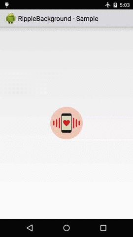
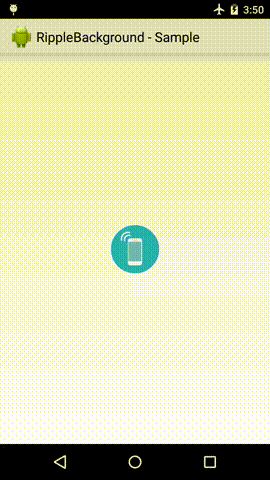

# Android Ripple Background

A beautiful ripple animation for your app. You can easily change its color, speed of wave, one ripple or multiple ripples. See demo below.

This library powered by [here](https://github.com/skyfishjy/android-ripple-background) that can change behavior it by programbillity.


　　　　　

## Usage

### Step 1

#### Install with `.aar` file
first step You should download [ripple.aar]("https://github.com/ImanX/android-ripple-background/blob/master/ripple.aar?raw=true") and copy it to `libs` project directory, now add `flatDir` command in `build.gradle`:

```groovy
allprojects {
    repositories {
        //
        flatDir {
            dirs 'libs'
        }
        //
    }
}

```
next step add `ripple.aar` to `build.gradle` module app:
```groovy
   implementation (name:'ripple' , ext:'aar')
```


### Step 2
#### RippleBackground

Add `RippleBackground` to your layout with content you want, like an ImageView. Configure the view customization elements using styleable attributes.
 
```xml
<com.skyfishjy.library.RippleBackground
    xmlns:android="http://schemas.android.com/apk/res/android"
    xmlns:app="http://schemas.android.com/apk/res-auto"
    android:layout_width="match_parent"
    android:layout_height="match_parent"
    android:id="@+id/content"
    app:rb_color="#0099CC"
    app:rb_radius="32dp"
    app:rb_rippleAmount="4"
    app:rb_duration="3000"
    app:rb_scale="6">
    <ImageView
        android:layout_width="64dp"
        android:layout_height="64dp"
        android:layout_centerInParent="true"
        android:id="@+id/centerImage"
        android:src="@drawable/demoImage"/>
</com.skyfishjy.library.RippleBackground>
```
Start animation:

```java
    final RippleBackground rippleBackground=(RippleBackground)findViewById(R.id.content);
    ImageView imageView=(ImageView)findViewById(R.id.centerImage);
    imageView.setOnClickListener(new View.OnClickListener() {
        @Override
        public void onClick(View view) {
                rippleBackground.setRippleDurationTime(100);
                rippleBackground.setRippleColor(getColor(android.R.color.holo_green_light));
                rippleBackground.setRippleAmount(1);
                rippleBackground.setRippleRadius(2);
                rippleBackground.startRippleAnimation();        }
    });
```
Stop animation:

```java
    rippleBackground.stopRippleAnimation();
```

## Programbillity
* setRippleType(int rippleType) 
* setRippleColor(int rippleColor)
* setRippleStrokeWidth(float rippleStrokeWidth)
* setRippleRadius(float rippleRadius)
* setRippleDurationTime(int rippleDurationTime)
* setRippleAmount(int rippleAmount)
* setRippleDelay(int rippleDelay)
* setRippleScale(float rippleScale)

 ```NOTE: You can after change values by Programbillity methods, invoke `startRippleAnimation` method for change behavioir ripple animation```


## Theming
* app:rb_color [color def:@android:color/holo_blue_dark] --> Color of the ripple
* app:rb_radius [dimension def:64dp ] --> Radius of the ripple
* app:rb_duration [integer def:3000 ] --> Duration of one ripple animation (millisecond) 
* app:rb_rippleAmount [integer def:6] --> Max amount of ripples at one screen
* app:rb_scale [interger def:6] --> Scale of ripple at the end of one animation cycle
* app:rb_type [enum (fillRipple, strokeRipple) def:fillRipple] --> Filled circle or ring
* app:rb_strokeWidth [dimension def:2dp] --> Stroke width of the ripple, ONLY work when rb_type="strokeRipple"

